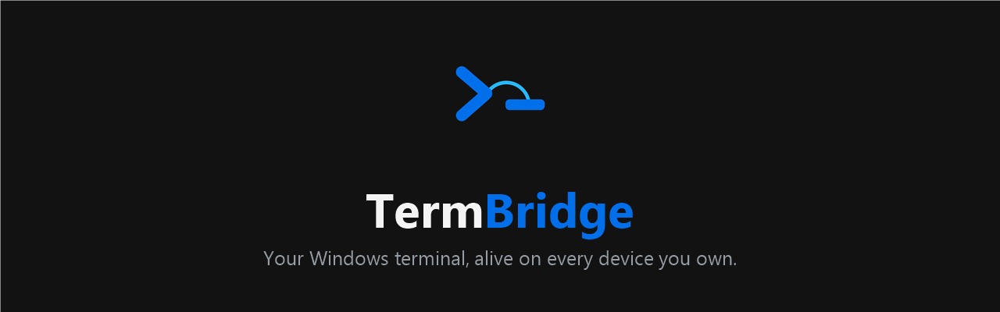
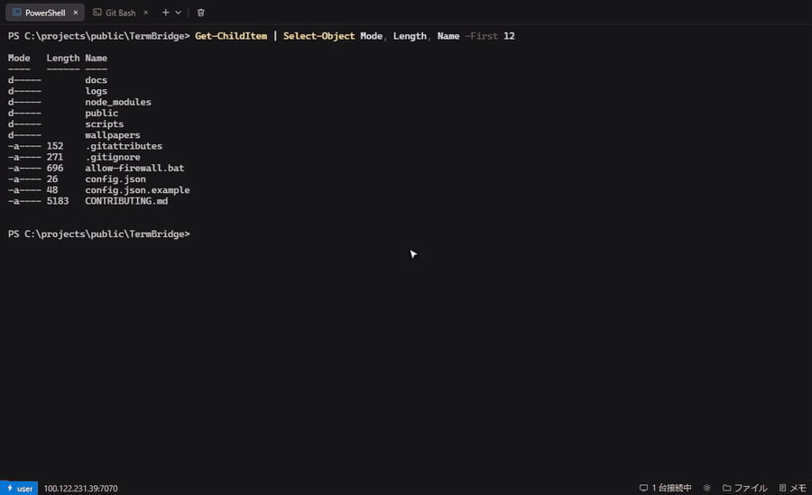
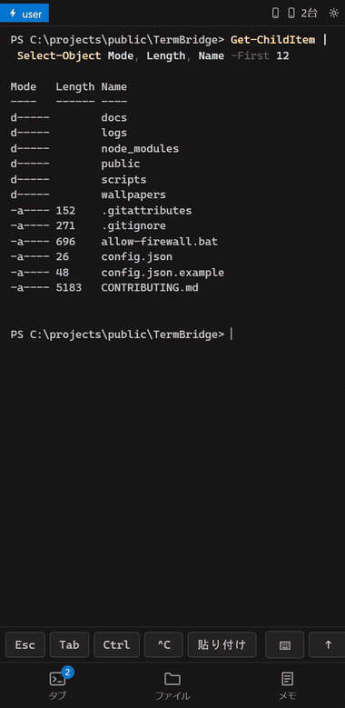
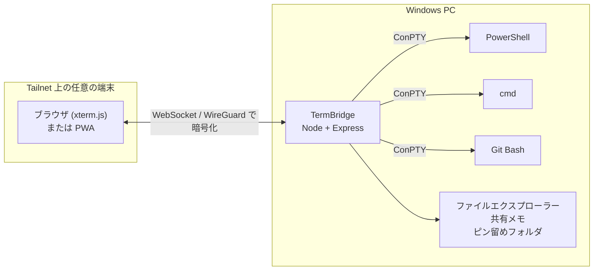

<p align="center">
  
</p>

<p align="center">
  
  
  
  
</p>

<p align="center">
  <a href="README.md">English</a> · <b>日本語</b>
</p>

---

TermBridge は、Windows PC のターミナルを、いま手に持っている端末で開けるようにする
ツールです。スマホでも、タブレットでも、別の PC でも構いません。**その端末側には何も
インストールしません。**[Tailscale](https://tailscale.com/) で繋がった自分のネットワーク
を通して、ブラウザで開くだけです。画面は VS Code のターミナルパネルを忠実に再現しています。

セッションはブラウザではなくサーバープロセス側で生きています。サイトを閉じても動作し続けます。

<p align="center">
  
  
</p>

<p align="center">
  <sub>画面をクリアして Claude Code を起動し、壁紙を設定して透明度を調整、続いてファイル
  エクスプローラーでショートカットを作成しフォルダーをピン留めしています。PC でもスマホでも
  同じビルド、同じ操作です。Claude Code のバナー内のアカウント名のみぼかしており、
  それ以外は加工していません。</sub>
</p>

## 機能

### ターミナル

- **PowerShell / cmd / Git Bash** を起動時に自動検出。タブごとにシェルを選択できます
- **最大24タブ**。ダブルクリックで名前変更、ドラッグで並べ替え、タブまたはヘッダーから強制終了
- **WebGL レンダリング**と Unicode 11 の文字幅対応により、日本語や絵文字の桁が崩れません
- **リンクがクリック可能** — コマンドが出力した URL をそのまま新しいタブで開けます
- **コピー**は選択して `Ctrl+C`、または選択して右クリック（Windows Terminal と同じ挙動）
- **貼り付け**は `Ctrl+V`（権限不要）、または右クリック（クリップボード権限を使用）
- `Ctrl+Shift+@` で新しいターミナル

### 全端末で共有

- **セッションはサーバー側で生きています。** タブを閉じても、ブラウザを閉じても、回線が切れても何も死にません
- **接続中の全端末が同じ出力をリアルタイムで受け取り**、どの端末からでも入力できます
- **再接続するとスクロールバックが再生されます**（直近約 300KB）
- **表示は接続中の最も小さい画面に合わせられます**（`tmux` と同じ方式）。ただし例外がひとつあり、PC も接続している間はスマホが桁数を縮めることはなく、広いままのターミナルを折り返してミラー表示します。PC が繋がっていなければスマホが自分の幅に合わせるので、全画面 TUI も収まる幅で描画されます
- **クリップボード共有** — PC でコピーしてスマホで貼り付け、その逆も可能です
- **接続端末の表示** — ステータスバーに、いまどの端末が接続中かが出ます
- **クライアントの自動リロード** — サーバー側のアセットが更新されると各端末が自動で読み直すため、端末を触らずに更新が反映されます

### スマホでの操作

- **ホーム画面に追加できます** — iOS は Safari の共有メニュー、Android は Chrome のメニューから。追加すると独自アイコンから起動し、全画面webアプリとして機能します。アプリのインストールは不要です。
- **狭い画面ではターミナルを実テキストとしてミラーリング**します。canvas と戦うのではなく OS 標準の選択ハンドルが使えるため、iOS でも選択とコピーが素直に動きます
- ソフトキーボードが隠してしまう `Esc` / `Tab` / `Ctrl` / `^C` / 貼り付け / 矢印の**キーバー**。キーボード自体の開閉ボタンも付いています
- タブ・新規・ファイル・メモへの**下部ナビゲーション**
- **タブ一覧は下から出るシート**で、親指で届きます

### ファイルエクスプローラー

- **全ドライブを閲覧**。戻る・進む・上へ・更新
- **隠し項目の表示**をトグルで切り替え
- **新規作成**（フォルダ／ファイル）、**名前の変更**、**削除はごみ箱へ**（完全削除ではありません）
- **コピー・切り取り・貼り付け**。右クリックしたフォルダへ直接貼り付けることもできます
- **パスのコピー** — シェルに貼れるよう引用符付きでコピーされます
- **`.bat` / `.cmd` の実行** — ダブルクリック（スマホはタップ）でターミナルタブとして開きます
- **ショートカットの作成** — ファイルやフォルダを右クリックすると、同じ場所に `.lnk` を作成できます。PC に触る必要はありません
- **Windows のショートカットがショートカットとして機能します** — リンク先がフォルダの `.lnk` はそのフォルダを開き、`.bat` を指す `.lnk` はショートカットに設定された引数と作業ディレクトリを引き継いで実行します。ピン留めと組み合わせれば、**ショートカットを並べたランチャーをスマホだけで組み立てて使える**ようになります
- **`start` 行がタブになる** — `.bat` 内の `start` コマンドは PC の画面に**ウィンドウを開きません**。それぞれ新しい Web タブとして開き、URL は通知に変わるので、いま手に持っているスマホで開けます
- **ピン留め** — フォルダ・`.bat`・ショートカットをエクスプローラー下部に常駐させられます。ピンは全端末で共有され、そこから直接起動できます

### メモ

- **全端末にリアルタイム同期される**メモ帳。`memo.txt` に保存されるので、PC 側から普通のファイルとして編集することもできます

### 外観

- **VS Code Dark Modern** テーマの忠実な再現
- **ライトモードとダークモード**の切り替え。端末ごとに記憶されます
- **壁紙** — 背景画像を設定できます。**PC 用とスマホ用は別々**に保存でき、透明度も調整できます

### 表示言語

- **日本語と英語**。設定メニューから、再読み込みなしで切り替わります
- 初回はブラウザの言語を自動判定し、以降は端末ごとに記憶します
- UI 全体に加えて、サーバーからのメッセージや新規作成されるファイル名まで対応します
  （`新しいフォルダー` / `New folder`）

### アクセス制御

- **トークン認証（任意）**。端末ごとに一度入力すればローカルに保存されます
- ターミナル接続とファイル API の両方を保護します

## 既存ツールとの違い

Web ターミナルは激戦区です。TermBridge が実際に違うのは次の点です。

| | TermBridge | ttyd / GoTTY | sshx | code-server |
|---|---|---|---|---|
| 切断してもセッションが残る | **○** | × | ○ | ○ |
| Windows ネイティブのシェル (ConPTY) | **○** | Unix 前提 | Unix 前提 | ○ |
| `.bat` をターミナルタブとして実行 | **○** | × | × | × |
| ファイルエクスプローラー内蔵 | **○** | × | × | ○ |
| スマホ前提の UI（キーバー・PWA） | **○** | × | 部分的 | × |
| 私的ネットワーク内で完結 | **○** | 自前で構築 | 中継あり | 自前で構築 |
| 規模 | 約300KB・依存4つ | 極小 | 小 | 重い |

Linux では永続化を `tmux` が担い、それをスマホ向け UI で包んだツールもあります。しかし
Windows には当てはまりません。PowerShell に tmux はなく、ブラウザより長生きする
セッションはサーバー自身に作り込むしかありません。それが TermBridge です。

もう半分は UI です。シェルに「繋ぐ」だけなら簡単でも、そこで「作業する」のは別問題です。
TermBridge は PC でもスマホでも、説明なしで触れる直感的な UI を目指しています。

## 必須環境

- Windows 10 または 11
- [Node.js](https://nodejs.org/) 20 以降
  - もしくは可搬版 Node を `runtime\node\node.exe` に置けば、システムには何もインストールされません
- [Tailscale](https://tailscale.com/) — 他の端末からアクセスする場合のみ必要

## インストール

```powershell
git clone https://github.com/IamaVibeCoder/TermBridge.git
cd TermBridge
npm install
```

## クイックスタート

`start.bat` をダブルクリックします。開くべき URL がコンソールに表示されます。

```
[termbridge] host: MY-PC  shells: powershell, cmd, gitbash  default: powershell
[termbridge] http://100.x.y.z:7070/
[termbridge] http://127.0.0.1:7070/
```

同じ Tailnet にサインインしている端末で最初の URL を開けば完了です。

続けて HTTPS を有効にしてください。コマンド 1 つで、最初にやっておく価値があります。

```powershell
powershell -ExecutionPolicy Bypass -File scripts\enable-https.ps1
```

`tailscale serve` がアプリの前段に入り、以降はコンソールに
`https://<マシン名>.<tailnet名>.ts.net/` が表示されます。そちらを使ってください。

**理由は貼り付けです。** ブラウザはセキュアコンテキストでしか OS のクリップボードを渡さない
ため、http のままだと `Ctrl+V` が他所でコピーした内容を読めず、右クリック →「貼り付け」に
頼ることになります。HTTPS なら普通に動きます。ホーム画面に PWA として追加するのも HTTPS が
必要です。

これは **Tailnet 内で完結**します。Funnel は使っていないため、インターネットには一切
公開されません。設定は再起動後も維持されます。解除は `tailscale serve --https=443 off` です。

サーバー自体を再起動後も動かし続けるには、ログオン時の自動起動を登録します（管理者権限は不要）。

```powershell
powershell -ExecutionPolicy Bypass -File scripts\install-startup.ps1
```

解除は `scripts\uninstall-startup.ps1` を実行してください。ログは `logs\termbridge.log` に出ます。

## 仕組み



接続中の全クライアントが同じ出力を受け取り、どこからでも入力できます。表示サイズは
接続中の最も小さいビューポートに合わせられます（`tmux` と同じ方式）。スマホは、PC も
見ている間はこの計算に加わらず、折り返して表示します。再接続すると直近約 300KB の
スクロールバックが再生されます。

## 設定

`config.json.example` を `config.json` にコピーして使います。すべて省略可能です。

| キー | 既定値 | 説明 |
|---|---|---|
| `port` | `7070` | 待ち受けポート |
| `host` | 自動 | 待ち受けアドレス。`"all"` で全インターフェース（**非推奨**） |
| `token` | なし | アクセストークン。設定すると認証必須になる |

環境変数 `PORT` / `TERMBRIDGE_HOST` / `TERMBRIDGE_TOKEN` でも指定できます。

## セキュリティ

> [!WARNING]
> **このページを開ける人は、あなたのシェルを完全に操作できます。**
> ロック解除済みの SSH セッションと同じ扱いをしてください。

TermBridge は `127.0.0.1` のみで待ち受け、それ以外では一切待ち受けません。LAN にも
Tailscale アドレスにもインターネットにもバインドせず、**受信ポートを 1 つも開きません。**
他の端末からは `tailscale serve` 経由で到達します。TLS はそこで終端され、ループバック経由で
本体に繋がるため、通信は暗号化され、ページは常に HTTPS です。Tailnet に他人の端末がある
場合は、あわせてトークン認証を有効にしてください。

脅威モデルと安全な設定は [SECURITY.md](SECURITY.md) にまとめています。

## トラブルシューティング

**他の端末からつながらない。** `tailscale serve` が未設定で、このマシン以外からは
到達できない状態です。`scripts\enable-https.ps1` を実行し、表示される
`https://<マシン名>.<tailnet名>.ts.net/` を開いてください。**ファイアウォールの設定は
不要です** — アプリはネットワークからの接続を直接受けません。

**`enable-https.ps1` が Tailscale を見つけられない。** 未インストールか、
`C:\Program Files\Tailscale\tailscale.exe` 以外の場所にあります。後者なら環境変数
`TAILSCALE_EXE` にパスを設定してください。インストール済みなら、起動とサインインを確認します。

**`tailscale serve` が既に別のものに向いている。** 同じパスには 1 つしか設定できないため、
スクリプトが上書き前に確認します。「いいえ」を選べば既存の設定はそのままで、TermBridge は
このマシンからのみ利用できる状態になります。

**`node` が見つからないと言われる。** Node.js 20 以降を入れるか、可搬版 Node を
`runtime\node\node.exe` に配置してください。

## ドキュメント

| | |
|---|---|
| 脅威モデル・安全な設定・報告 | [SECURITY.md](SECURITY.md) |
| コントリビューションと方針 | [CONTRIBUTING.md](CONTRIBUTING.md) |
| English README | [README.md](README.md) |

## 構成

```
server.js     Node サーバー — node-pty で ConPTY を生成し WebSocket で配信
public/       フロントエンド — xterm.js + VS Code Dark Modern テーマ
scripts/      起動・自動起動登録スクリプト
```

## ライセンス

[MIT](LICENSE)
