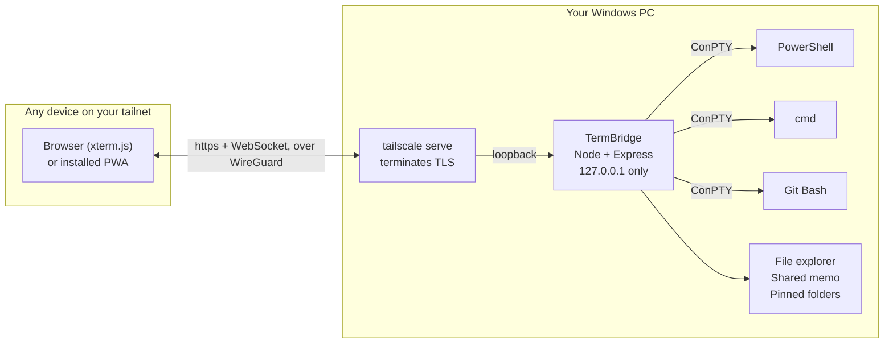

<p align="center">
  
</p>

<p align="center">
  
  
  
  
</p>

<p align="center">
  <b>English</b> · <a href="README.ja.md">日本語</a>
</p>

---

TermBridge opens your Windows PC's terminal on whatever device you happen to be
holding — your phone, a tablet, another laptop. **Nothing gets installed on that
device.** It opens in the browser, over your own [Tailscale](https://tailscale.com/)
network, and the interface is a faithful reproduction of the VS Code terminal panel.

Sessions live in the server process, not in the browser. Close the page and it keeps
running.

<p align="center">
  
  
</p>

<p align="center">
  <sub>Clearing the screen and starting Claude Code in the session, setting a wallpaper and
  dialling in its opacity, then the file explorer: a shortcut created and a folder pinned.
  Same build, same actions, on a desktop and on a phone. The account name in the Claude
  Code banner is blurred; nothing else is retouched.</sub>
</p>

## Features

### Terminal

- **PowerShell, cmd, and Git Bash**, auto-detected at startup — pick the shell per tab
- **Up to 24 tabs.** Rename by double-clicking, reorder by dragging, force-kill from the tab or the header
- **WebGL rendering** with Unicode 11 width handling, so CJK text and emoji line up correctly
- **Clickable links** — URLs printed by a command open in a new browser tab
- **Copy** by selecting and pressing `Ctrl+C`, or by right-clicking a selection — the same behavior as Windows Terminal
- **Paste** with `Ctrl+V` (no permission needed), or by right-click using the clipboard permission
- `Ctrl+Shift+@` opens a new terminal

### Shared across devices

- **Sessions live on the server.** Closing the tab, closing the browser, or losing the network does not kill anything
- **Every connected device sees the same output** in real time, and any of them can type
- **Reconnecting replays the scrollback** — roughly the last 300 KB
- **The terminal is sized to the smallest screen watching it**, the same approach `tmux` takes — with one exception: a phone will not shrink it while a desktop is also watching, and mirrors the wider terminal as wrapped text instead. With no desktop attached the phone does size it to itself, so full-screen TUIs draw at a width that fits
- **Shared clipboard** — copy on your PC, paste on your phone, or the other way around
- **Presence** — the status bar shows which devices are currently connected
- **Clients reload themselves** when the server's assets change, so every device picks up an update without being touched

### On a phone

- **Add to home screen** — on iOS use Safari's Share menu, on Android use Chrome's menu. It then launches from its own icon and runs as a full-screen web app. No app install required
- **The terminal is mirrored as real text** on narrow screens, so text selection and copy use the OS's own handles instead of fighting a canvas — this is what makes selection work properly on iOS
- **Edit the command line with the phone's own keyboard.** Tap anywhere on it to put the cursor there, then insert, delete, and convert text exactly as you would in any text field — IME conversion included. Edits are translated into terminal input, and the shell stays the source of truth
- **Key bar** for `Esc` / `Tab` / `Ctrl` / `^C` / paste / arrows — the keys a software keyboard hides — plus a button to show and hide the keyboard itself
- **Bottom navigation** for tabs, new terminal, files, and memo
- **Tab list as a bottom sheet**, reachable with a thumb

### File explorer

- **Browse every drive** with back, forward, up, and refresh
- **Show hidden items** with a toggle
- **Create** new folders and files; **rename**; **delete to the Recycle Bin** rather than permanently
- **Copy, cut, and paste**, including pasting straight into a folder you right-clicked
- **Open Command Prompt or PowerShell in any folder** from its right-click menu on PC or long-press menu on mobile
- **Copy path** to the clipboard, already quoted for pasting into a shell
- **Run `.bat` and `.cmd` files** — double-click (or tap) and it opens as a terminal tab
- **Create shortcuts** — right-click any file or folder to drop a `.lnk` beside it, without touching the PC
- **Windows shortcuts behave like shortcuts** — a `.lnk` pointing at a folder opens that folder, and one pointing at a `.bat` runs it with the arguments and working directory stored in the shortcut. Together with pins, a folder of shortcuts becomes a launcher you can build and use entirely from your phone
- **`start` lines become tabs** — a `start` command inside a `.bat` will *not* open a window on the PC's screen. Each one becomes a new web tab instead, and URLs turn into notifications you can open on the phone you are actually holding
- **Pins** — pin folders, `.bat` files, or shortcuts to the bottom of the explorer. Pins are shared across every device, and pinned items launch straight from there

### Memo

- A scratchpad **synced live to every device**, saved to `memo.txt` so it is a normal file you can also edit on the PC

### Appearance

- Faithful reproduction of the **VS Code Dark Modern** theme
- **Light and dark modes**, remembered per device
- **Wallpaper** — set a background image, with **separate images for desktop and mobile** and an adjustable opacity

### Language

- **English and Japanese**, switched from the settings menu with no reload
- Picks up your browser's language on first visit, then remembers the choice per device
- Covers the whole interface, including server messages and the names of files it creates
  (`New folder` / `新しいフォルダー`)

### Access control

- **Optional token authentication**, entered once per device and stored locally
- Guards both the terminal connection and the file API

## Why not just use X?

Web terminals are a crowded field. Here is where TermBridge actually differs:

| | TermBridge | ttyd / GoTTY | sshx | code-server |
|---|---|---|---|---|
| Sessions survive disconnect | **Yes** | No | Yes | Yes |
| Native Windows shells (ConPTY) | **Yes** | Unix-oriented | Unix-oriented | Yes |
| Runs `.bat` as a terminal tab | **Yes** | No | No | No |
| File explorer built in | **Yes** | No | No | Yes |
| Phone-first UI (key bar, PWA) | **Yes** | No | Partial | No |
| Stays inside your private network | **Yes** | You build it | Relayed | You build it |
| Weight | ~300 KB, 4 deps | Tiny | Small | Heavy |

On Linux the persistence half of this is `tmux`, and phone-friendly wrappers around
it already exist. None of that transfers to Windows: there is no tmux for
PowerShell, so a session that outlives the browser has to be built into the server
itself. That is what TermBridge does.

The other half is the interface. Connecting to a shell is easy; *working* on one is
not. TermBridge is built to be intuitive on a desktop and on a phone alike — with
nothing to learn before you can use it.

## Requirements

- Windows 10 or 11
- [Node.js](https://nodejs.org/) 20 or newer
- [Tailscale](https://tailscale.com/) installed, running, and signed in

## Install

```powershell
git clone https://github.com/IamaVibeCoder/TermBridge.git
cd TermBridge
npm install
```

## Quick start

Double-click `start.bat` (or run `npm start`). It selects a local port, configures
`tailscale serve --bg`, and prints the HTTPS address to open:

```
[https] Ready: https://my-pc.tailname.ts.net/
[termbridge] host: MY-PC  shells: powershell, cmd, gitbash  default: powershell
[termbridge] http://127.0.0.1:7070/
[termbridge] https://my-pc.tailname.ts.net/  <- open this on your other devices
```

Open the second address on any device signed into the same tailnet. That's it — the
Serve setting persists, so later runs reuse it. Starting TermBridge again while this
copy is already running exits cleanly instead of creating a duplicate server.

If another app is using port 7070, `start.bat` automatically selects the next free
port (up to 100 candidates) and passes the same value to both TermBridge and
`tailscale serve`.

Under the hood this uses `tailscale serve --bg`. If another app already owns HTTPS
port 443, its route is preserved and TermBridge tries the conventional alternative,
8443. In that case, open the URL it prints, such as
`https://my-pc.tailname.ts.net:8443/`.

If both are occupied, startup stops instead of guessing another port. Set
`httpsPort` in `config.json` to any free port you prefer, then run `start.bat` again.

**Why not just the tailnet IP?** Because a browser only hands the OS clipboard to a
page in a secure context. Over plain http, `Ctrl+V` cannot read what you copied
somewhere else and you are stuck with right-click → Paste; over https it just works.
Adding the app to a home screen as a PWA needs https too. So TermBridge listens on
`127.0.0.1` only and lets `tailscale serve` do the TLS — which also means no inbound
port is open at all.

It stays **inside your tailnet** — Funnel is not used, so nothing is published to
the internet. Inspect the active routes with `tailscale serve status`.

To keep the server itself running across reboots, register a logon task (no admin
rights needed):

```powershell
powershell -ExecutionPolicy Bypass -File scripts\install-startup.ps1
```

Remove it with `scripts\uninstall-startup.ps1`. The scripts keep an exact PID record,
so uninstalling stops this TermBridge instance without touching unrelated Node.js
processes. Logs are written to `logs\termbridge.log`.

## How it fits together



Every connected client receives the same output stream and can type into it. The
terminal is resized to the smallest attached viewport, the same approach `tmux` takes;
a phone stays out of that calculation while a desktop is watching and wraps instead.
Reconnecting replays roughly the last 300 KB of scrollback.

## Configuration

Copy `config.json.example` to `config.json`. All keys are optional.

| Key | Default | Description |
|---|---|---|
| `port` | `7070` | Preferred listening port; `start.bat` selects the next free port when it is occupied |
| `httpsPort` | `443` | Tailscale HTTPS port. If omitted, startup tries 443 and then 8443; set it to use a specific free port |
| `host` | `127.0.0.1` | Listening address. Pointing it at another interface serves plain http there as well — only useful behind your own TLS proxy. `"all"` binds every interface (**not recommended**) |
| `token` | none | Access token. Setting it makes authentication mandatory |

The environment variables `PORT`, `TERMBRIDGE_HOST`, and `TERMBRIDGE_TOKEN` work too.

## Security

> [!WARNING]
> **Anyone who can open this page gets full control of your shell.** Treat it with
> the same care as an unlocked SSH session.

TermBridge listens on `127.0.0.1` and nothing else. It is not bound to your LAN, your
Tailscale address, or the internet — no inbound port is open at all. Other devices
reach it through `tailscale serve`, which terminates TLS and connects over loopback,
so the traffic is encrypted and the page is always https. If other people's devices
are on your tailnet, turn on token authentication as well.

See [SECURITY.md](SECURITY.md) for the threat model and hardening steps.

## Troubleshooting

**Startup stops at the `[https]` line.** `tailscale serve` is configured before the
server launches, so Tailscale has to be installed, running, and signed in. Check with
`tailscale status`. To run without Tailscale — reachable from this PC only — use
`npm run start:local`.

**Other devices can't connect.** Restart `start.bat` and use the
`https://<machine>.<tailnet>.ts.net/` address it prints. Inspect the active mapping
with `tailscale serve status`. No firewall change is needed — the app never accepts
a connection from the network directly.

**Ports 443 and 8443 already have `tailscale serve` routes.** Existing routes are not
replaced. Copy `config.json.example` to `config.json`, choose a free `httpsPort`, and
restart `start.bat`.

**`node` is not recognized.** Install Node.js 20 or newer, then run `npm install`.

## Documentation

| | |
|---|---|
| Threat model, hardening, reporting issues | [SECURITY.md](SECURITY.md) |
| Contributing and project scope | [CONTRIBUTING.md](CONTRIBUTING.md) |
| 日本語版 README | [README.ja.md](README.ja.md) |

## Project layout

```
start.bat     Recommended Windows entry point
server.js     Node server — ConPTY, WebSocket, and local APIs
public/       Browser client and PWA assets
scripts/      Port selection, Tailscale Serve, and logon-task management
```

## License

[MIT](LICENSE)
